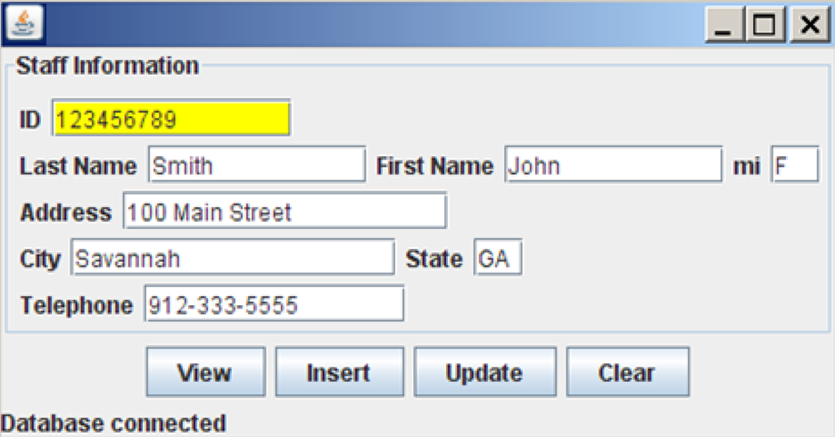

# ITC-5201-Java-Assignment04

- Semester: #02
- Course: ITC-5201-Java
- Assignment: #04 - GUI Design, data validation, exception handling and Database
- Group: #03
- Member:
  - Ansh Bhardwaj
  - Tsz Kit Cheung(Kevin)
  - Wenhao Fang(Simon)

---

## Program Design

- Package `model`:

  - `Staff` class: the class that represents the data in database

  ```mermaid
  classDiagram

        class Staff{
            -ID: string
            -lastName: string
            -firstName: string
            -mi: string
            -address: string
            -city: string
            -state: string
            -telephone: string
            -email: string
            +toString():string
        }

  ```

---

- Package `controller`:

  - `StaffController` class: the class that queries data from the database and transmits to UI, as well as collects changes of data from UI and commits to the database.

  ```mermaid
  classDiagram

        class StaffController{
            -connection:Connection
            +isConnect():boolean
            +isUnique(id:string):boolean
            +getStaff(id:string):Staff
            +createStaff(staff:Staff):boolean
            +updateStaff(id:string, staff:Staff):boolean
            +deleteStaff(id:string):boolean
        }

  ```

---

- `Response` class: the class that communicates between UI and Controller, providing a decoupling development to make UI and database independent from each other.

  ```mermaid
  classDiagram

        class Response{
              +status: string
              +message: string
              +data: Staff
        }

  ```

---

- Package `view`:

  - Design
    
  - Functionalities
    - validat input
    - display connection status
    - ActionListener
      - View: `.getStaff(id:string)`
      - Insert: `+createStaff(staff:Staff)`
      - Update: `+updateStaff(id:string, staff:Staff)`
      - Clear:`+deleteStaff(id:string)`

---

- `StaffDemo`: the class with main functioin, providing a uniform entry for debug

---

## Version 1.000

- Create github respository
- Create files architecture accordingly

---

## Version 1.001

- Add functionalities: `StaffController.java`
  - isConnect()
  - isUnique(id:string)
  - getStaff(id:string)
  - createStaff(staff:Staff)
  - updateStaff(id:string, staff:Staff)
  - deleteStaff(id:string)

- Add sample of adding actionListener in UI

---

[TOP](#itc-5201-java-assignment04)
